# (100%) JavaScript 網頁設計 1N 期末上機考-2 -- 開放考試

##### 2024-6-13 at E201

#### Note:

1. 請不要發揮同學愛，作弊雙方除了本次考試 0 分外，平常分數另扣 20 分，情節嚴重者會送校。
2. iClass 上請繳交 md_xx.zip，還有 f2_xx.zip 2 個檔
3. 請直接將答案寫在 f2_xx.md 上，老師實作的圖片放在 f2_htc.pdf 上，請依照老師所給的圖片來實作並標註
4. 請用老師提供的 f2_xx code 來實作 P2, P3, P4, P5 等 4 題
5. 跟期中考相關的檔案及目錄名稱有 xx 時，必須要改成學號後 2 碼，沒有修改時，會視違犯情況扣分。跟期中考題無關的檔案及目錄名稱有 xx，則不必修改。
6. 每一張圖片要有機房左側背景，圖片上要有你的學號(或後兩碼)，圖片標註要跟老師所標註的類似。違者會依情節扣分。
7. 有標註要 git log 的題目，必須要做，這是我們上課練習的一部分。
8. 請自評分數，將每一題的 ? 填入分數，沒有填者，不會批改，以 0 分計算。

##### Your (Name, ID): (陳亮瑜, 208410331)

##### f2 開放網路題目 (50%)

- P1-1 (10%): 10 分
- P1-2 (10%): 10 分
- P1-3 (10%): 10 分
- P1-4 (10%): 10 分
- P2 (20%): 20 分
- P3 (15%): ? 分
- P4 (15%): ? 分
- P5 (10%): ? 分

##### 總分: ? 分

---

## (40%) P1: Show Info of Your Github Repo, Client Supa Github, Vercel as follows

#### (10%) P1-1: Show Your Github Repo for all md and demo

##### => My Github repo URL

[https://github.com/htchung/1122-js-demo-xx/](https://github.com/htchung/1122-js-demo-xx/)

#### => 下圖左邊框顯示所有周次的 demo，右邊框顯示所有周次的 md


#### Your Answer

##### => My Github repo URL

[My Github repo URL for demo](https://github.com/liangyu9103/1122-js-demo_31)

#### => 下圖左邊框顯示所有的 demo，右邊框顯示所有的 md

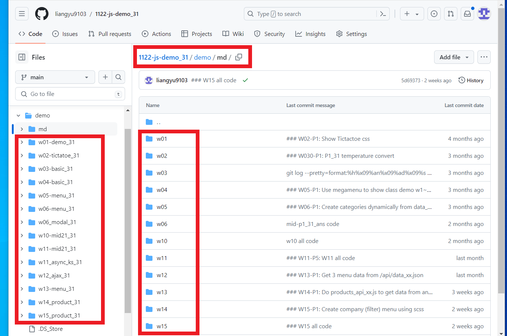

##### => git log

```
git log --pretty=format:"%h%x09%an%x09%ad%x09%s" --after="2024-06-12"

9a5b836 liangyu9103     Thu Jun 13 18:49:14 2024 +0800  #### P1-1: Show Your Github Repo for all md and demo

```

---

#### (10%) P1-2: Show all your git logs from W10 to W15

##### => My Github URL for git logs，標註本學期 git log 次數

[My Github URL for git logs]()


#### => git log for w15 and w14


#### => git log for w13 and w12


#### => git log for w11 and w10


#### Your Answer

##### => My Github URL for git logs，標註本學期 git log 次數

[My Github URL for git logs](https://github.com/liangyu9103/1122-js-demo_31/commits/main/)

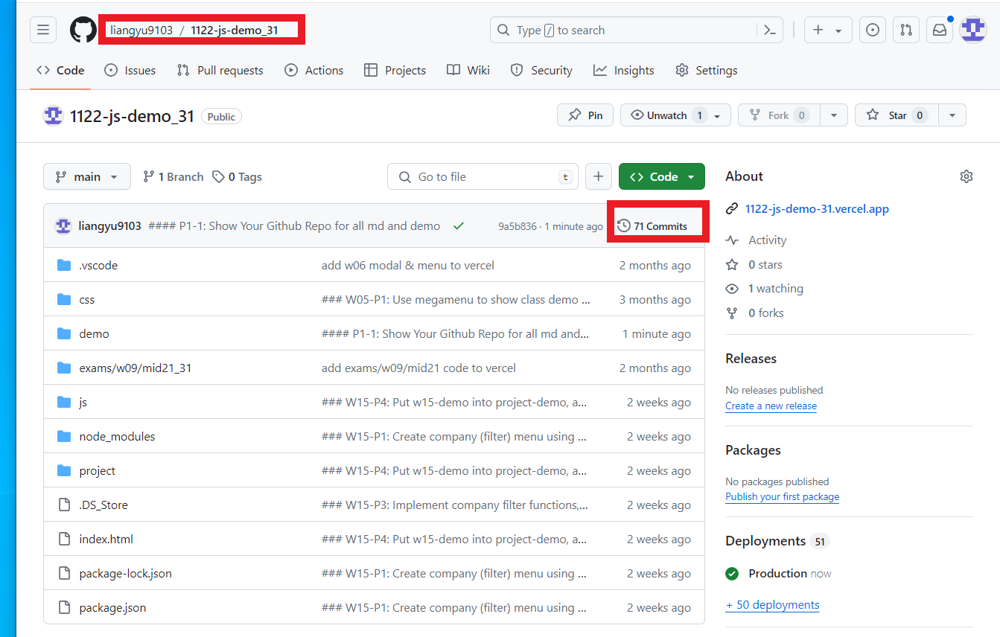

#### => git log for w15 and w14

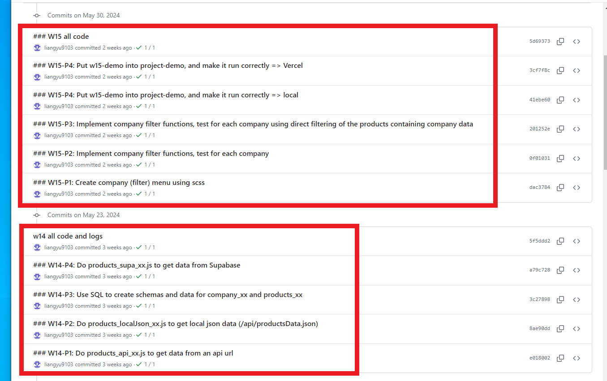

#### => git log for w13 and w12

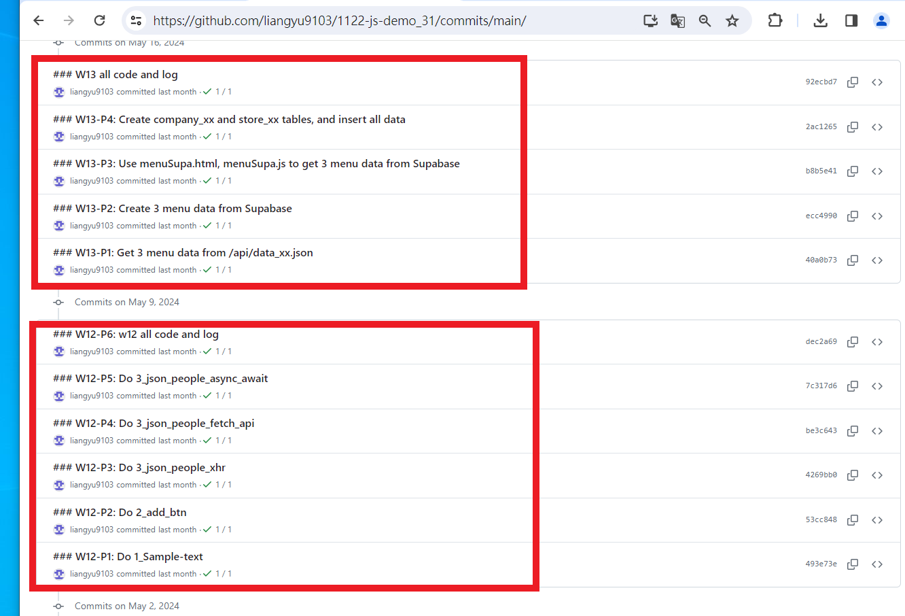

#### => git log for w11 and w10

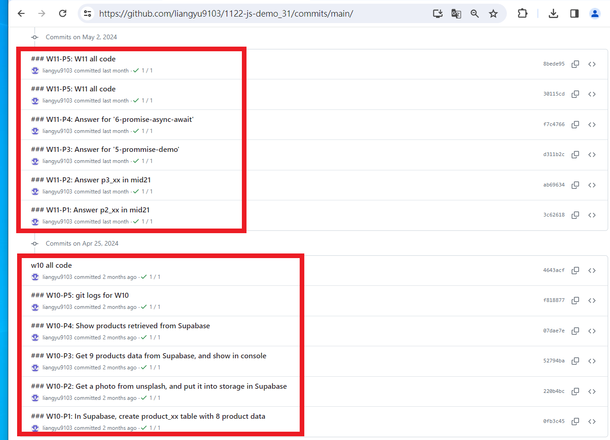

##### => git log

```
git log --pretty=format:"%h%x09%an%x09%ad%x09%s" --after="2024-06-12"

168f365 liangyu9103     Thu Jun 13 18:53:32 2024 +0800  ##### P1-2: My Github URL for git logs，標註本學期 git log 次數

583caf7 liangyu9103     Thu Jun 13 18:56:10 2024 +0800  P1-2: git log for w15 and w14

ed754ea liangyu9103     Thu Jun 13 18:58:00 2024 +0800  ##### P1-2: git log for w13 and w12

6580e04 liangyu9103     Thu Jun 13 18:59:55 2024 +0800  ##### P1-2: git log for w11 and w10
```

---

#### (10%) P1-3: 佈署 w15 product demo 到 Vercel，並顯示如下資訊

[w15 product demo in Vercel](https://1122-js-demo-xx.vercel.app/#)

##### => 顯示在 Vercel 上的 demo


#### Your Answer

[w15 product demo in Vercel](https://1122-js-demo-31.vercel.app/#)

##### => 顯示在 Vercel 上的 demo

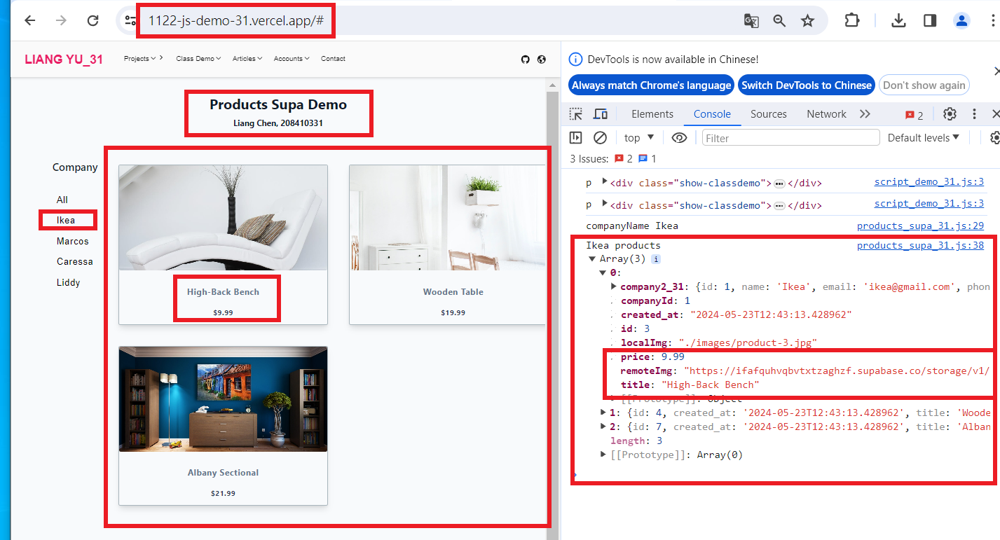

##### => git log

```
git log --pretty=format:"%h%x09%an%x09%ad%x09%s" --after="2024-06-12"

d7f1ae0 liangyu9103     Thu Jun 13 19:06:59 2024 +0800  let w15 product demo in Vercel

1e41d4c liangyu9103     Thu Jun 13 19:13:45 2024 +0800  ##### P1-3: 顯示在 Vercel 上的 demo

```

---

#### (10%) P1-4: Supabase SQL 基本操作

請用 SQL 產生 blog_f2_xx table，並匯入 6 筆資料，第一筆資料的 id 必須是你學號的最後一個數字，結果請從 Vercel 上顯示

##### => 執行 SQL 指令


##### => 用 SQL 指令取得 blog_f2_xx 所有資料

```
select * from blog_f2_xx;
```


#### Your Answer

##### => 執行 SQL 指令

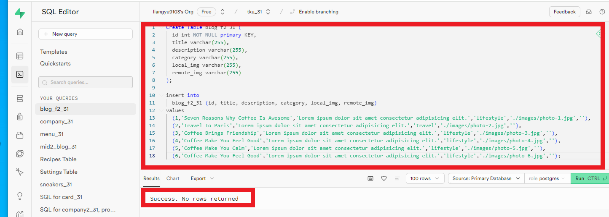

##### => blog_f2_xx table 顯示

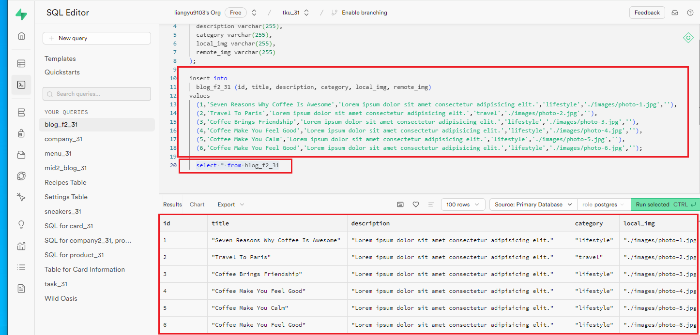

##### => git log

```
git log --pretty=format:"%h%x09%an%x09%ad%x09%s" --after="2024-06-12"

6ea9bae liangyu9103     Thu Jun 13 19:30:23 2024 +0800  ##### P1-4: 執行 SQL 指令

0927d52 liangyu9103     Thu Jun 13 19:31:46 2024 +0800  ##### P1-4: blog_f2_xx table 顯示

```

---

# 以下 P2, P3, P4, P5 題目請透過老師提供的 theme-crown 來實作，如有 xx 需改成學號後兩碼。

## (20%) P2: 實作靜態畫面，點選上方選單 Shop_xx, logo 及主頁面的某 category，可以正常切換

請以學號最後一碼除以 5 取餘數 (value)，取得 category
value =1, category = 'hats'
value =2, category = 'jackets'
value =3, category = 'sneakers'
value =4, category = 'womens'
value =5, category = 'mens'

本題老師選擇 value = 4 (womens) 來實作

##### => 目錄結構及檔名如下


##### => 執行 p1_xx.html 顯示頁面如下，請框住你需要實作的 category 圖片，本題老師 demo 是 womens


##### => 顯示本功能修改了那些 code

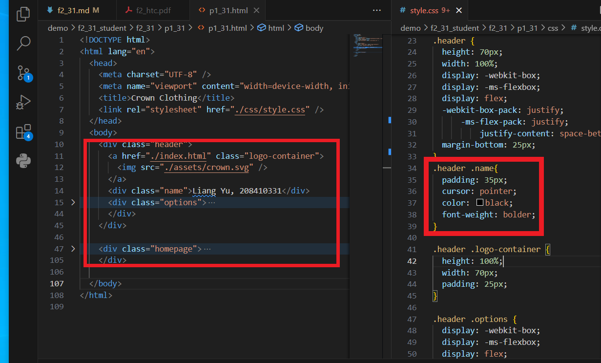

##### => 點選你需要實作之 category 圖片，要能顯示該 category 下的所有產品圖片，本題顯示 womens 下的 7 張圖片


##### => 顯示本功能修改了那些 code


##### => 點選 logo 回到 p1_xx.html


##### => 顯示本功能修改了那些 code


##### => 點選 Shop_xx 顯示 2 個 category 圖片，每個 category 4 張圖片

老師 demo，使用的學號後 2 碼是 54，4 屬 womens, 5 屬 mens，因此先顯示 womens 4 張圖片，再顯示 mens 4 張圖片，如果兩個數字一樣，則取下一個數字，如果是 55，就取 mens (5) 及 hats (1)


##### => 顯示本功能修改了那些 code


#### Your Answer

##### => 目錄結構及檔名

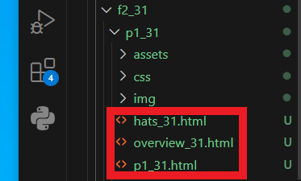

##### => 執行 p1_xx.html 顯示頁面如下，請框住你需要實作的 category 圖片，本題老師 demo 是 womens

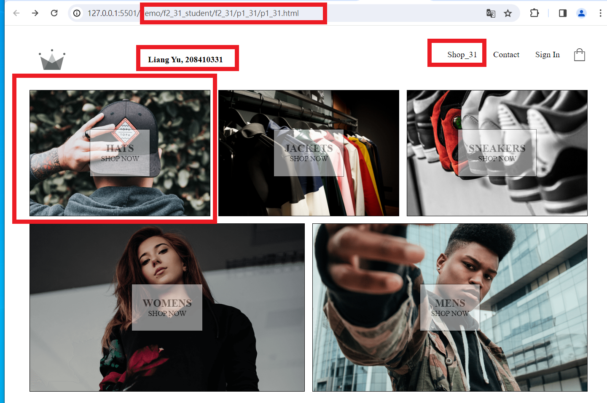

##### => 顯示本功能修改了那些 code


##### => 點選你需要實作之 category 圖片，要能顯示該 category 下的所有產品圖片，本題顯示 womens 下的 7 張圖片

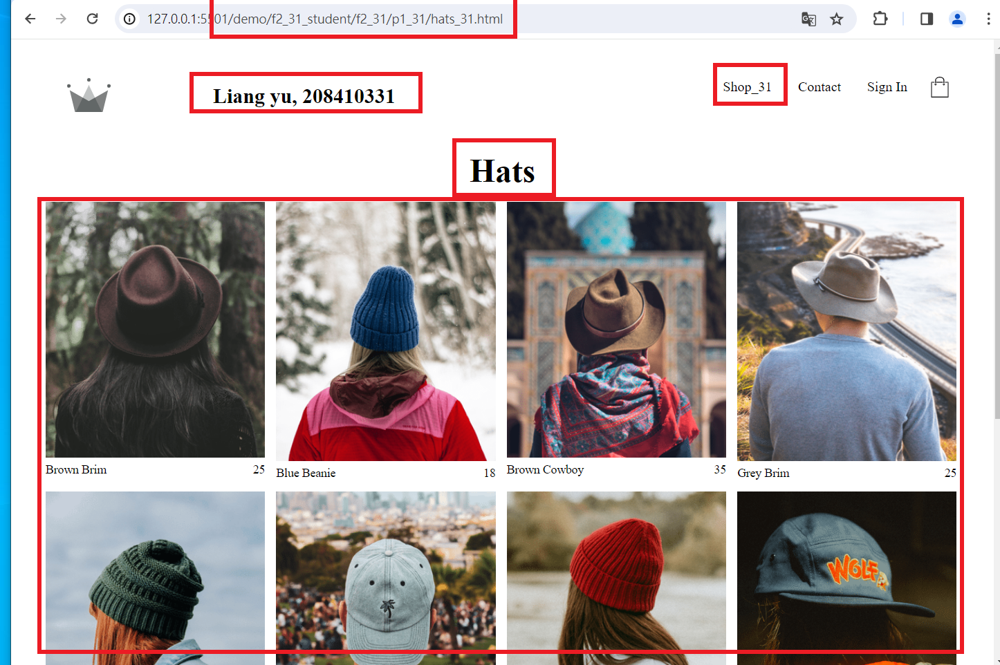

##### => 顯示本功能修改了那些 code

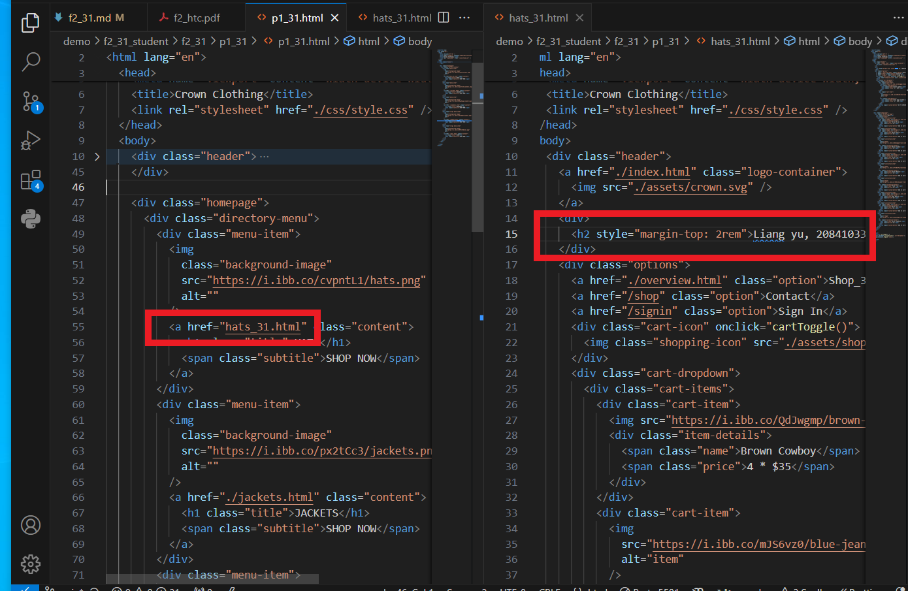

##### => 點選 logo 回到 p1_xx.html

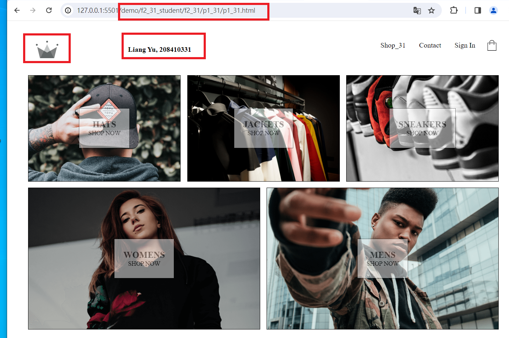

##### => 顯示本功能修改了那些 code

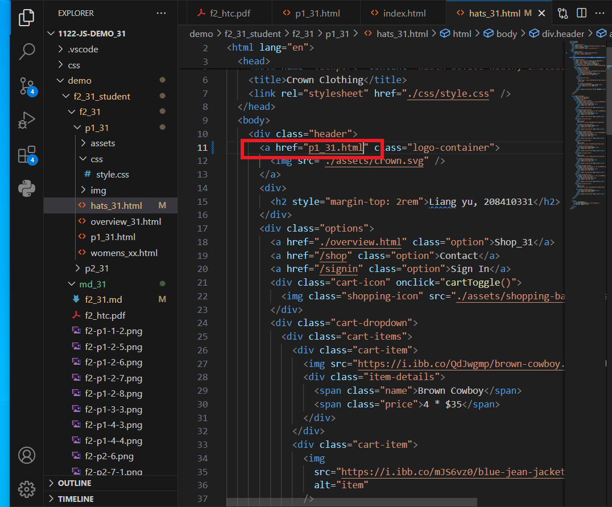

##### => 點選 Shop_xx 顯示 2 個 category 圖片，每個 category 4 張圖片

老師 demo，使用的學號後 2 碼是 54，4 屬 womens, 5 屬 mens，因此先顯示 womens 4 張圖片，再顯示 mens 4 張圖片

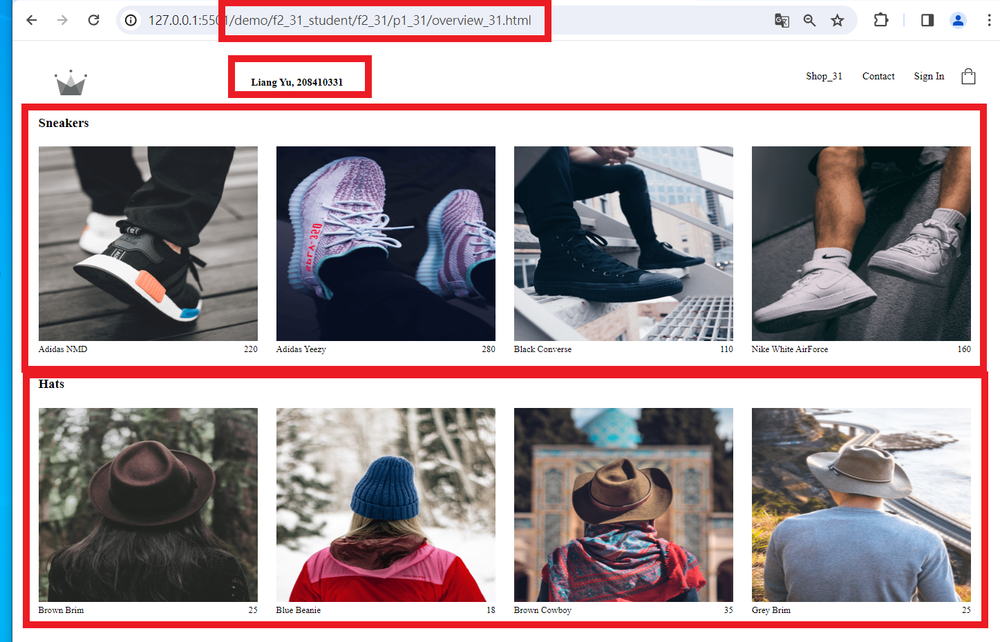

##### => 顯示本功能修改了那些 code

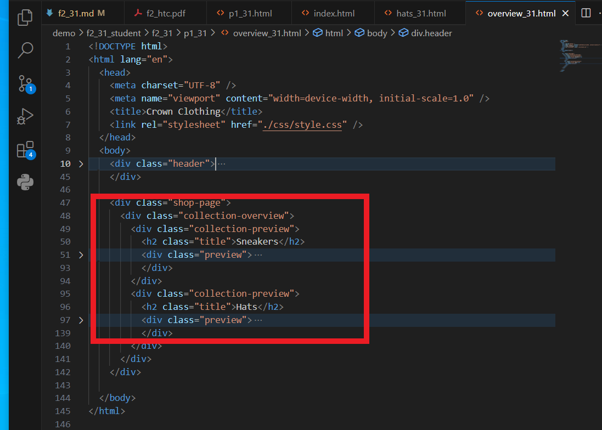

##### => git log

```
git log --pretty=format:"%h%x09%an%x09%ad%x09%s" --after="2024-06-12"

e17d4ee liangyu9103     Thu Jun 13 19:58:02 2024 +0800  ##### P2: 目錄結構及檔名
a281aaa liangyu9103     Thu Jun 13 20:00:43 2024 +0800  ##### P2: 執行 p1_xx.html 顯示頁面如下
5ea1b06 liangyu9103     Thu Jun 13 20:05:08 2024 +0800  ##### P2: 顯示本功能修改了那些 code
44823e5 liangyu9103     Thu Jun 13 20:12:15 2024 +0800  ##### P2: 點選你需要實作之 category 圖片，本題顯示hats下圖片
d57dcd7 liangyu9103     Thu Jun 13 20:37:21 2024 +0800  ##### P2: 點選 Shop_xx 顯示 2 個 category 圖片
4a77f84 liangyu9103     Thu Jun 13 20:41:16 2024 +0800  ##### P2: 顯示本功能修改了那些 code
```

---

### 請將 p1_xx 目錄下所有檔案，複製到 p2_xx 準備從 Supabase 將資料放入 womens_xx.html (或其他你需要做的 category), overview_xx.html

#### (15%) P3: 請將 P2 題所需要的資料用 SQL 來建立

本說明是以 womens 7 張圖片及 mens 6 張圖片來說明

##### => 用 SQL create table 建立 store_f2_xx，其中必須有一個欄位要建立 category_id， 其資料設定為 1~5 (如 P2 題之設定)，用 SQL insert into 匯入 womens 7 張圖片資料。create table 跟 insert into 要一次執行，能建立及匯入資料。

category_f2_xx SQL 指令老師會提供，請先執行，再進行本題


##### => ，並下 SQL 指令搜尋 womens 資料


#### Your Answer

##### => 用 SQL create table 建立 store_f2_31

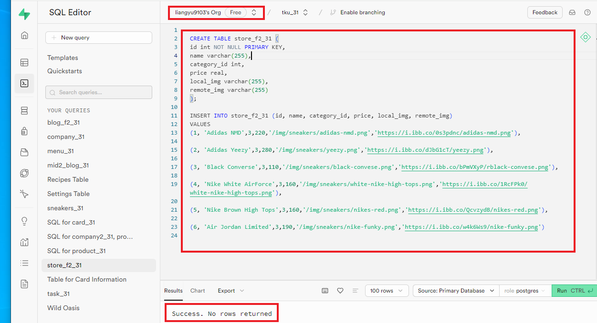

##### => 用 SQL insert into 匯入 sneakers 6 張圖片資料，並下 SQL 指令搜尋 sneakers 資料

標題 womens 請改成你所需要實作的 category

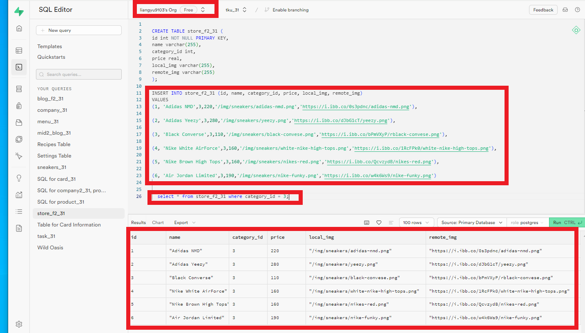

##### => 用 SQL insert into 匯入 hats 6 張圖片資料，並下 SQL 指令搜尋 mens 資料

標題 mens 請改成你所需要實作的 category，顯示如上 womens 截圖，先執行 insert into，再執行 select 篩選指令

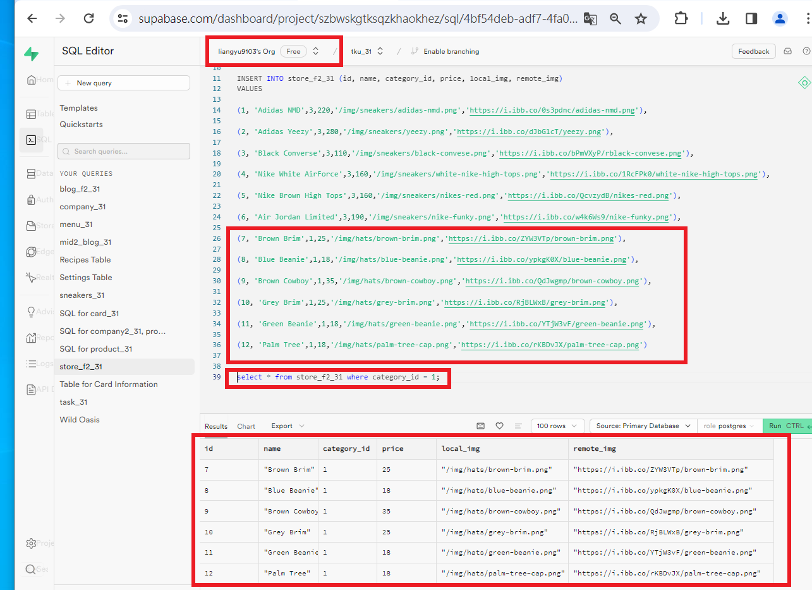

##### => git log

```
git log --pretty=format:"%h%x09%an%x09%ad%x09%s" --after="2024-06-12"

0105ba4 liangyu9103     Thu Jun 13 21:06:46 2024 +0800  ##### P3 : 用 SQL create table 建立 store_f2_31

949e681 liangyu9103     Thu Jun 13 21:11:37 2024 +0800  ##### P3: 用 SQL insert into 匯入 sneakers 6 張圖片資料，並下 SQL 指令搜尋 sneakers 資料

```

---

#### (15%) P4: 請將 womens.html 內的 7 張圖片，改成是自 Supabase 取得並套用。

##### => 顯示 womens_xx.html，圖片顯示的區塊是空的；顯示 Supabase API keys


##### => Supabase API key 必須和上一小題相符合


##### => Chrome 顯示可以呈現 womens 7 張圖片，要用 console.log 呈現有自 Supabase 取的資料


#### Your Answer

##### => 顯示 womens_xx.html，圖片顯示的區塊是空的；顯示 Supabase API keys


##### => Supabase API key 必須和上一小題相符合


##### => Chrome 顯示可以呈現 womens 7 張圖片，要用 console.log 呈現有自 Supabase 取的資料

標題 womens 請改成你所需要實作的 category


##### => 顯示根本題有關的 js/p2_xx.js code


##### => git log

```

```

---

#### (10%) P5: 請將 overview_xx.html 內的 womens 4 張圖片 及 mens 4 張圖片，換成是從 Supabase 取得並套用。

Hint: 可取得 womens 所有資料後再用 slice 陣列指令取得前四筆，總共要自 Supabase 取兩次，第一次取的 womens 資料，第二次取得 mens 資料

##### => 顯示 overview_xx.html 中顯示 Women 圖片之區塊是空的


##### => Chrome 顯示可以呈現 womens 4 張圖片，要用 console.log 呈現自 Supabase 取的資料


##### => Chrome 顯示可以呈現 mens 4 張圖片，要用 console.log 呈現自 Supabase 取的資料


#### Your Answer

##### => 顯示 overview_xx.html 中顯示 Women 圖片之區塊是空的

標題 womens 請改成你所需要實作的 category


##### => Chrome 顯示可以呈現 womens 4 張圖片，要用 console.log 呈現有自 Supabase 取的資料


##### => 顯示跟取得 womens 有關的 js/p2_xx.js code


##### => 顯示 overview_xx.html 中顯示 Mens 圖片之區塊是空的

標題 Mens 請改成你所需要實作的 category


##### => Chrome 顯示可以呈現 Mens 4 張圖片，要用 console.log 呈現有自 Supabase 取的資料


##### => 顯示跟取得 mens 有關的 js/p2_xx.js code


##### => git log

```

```

---
