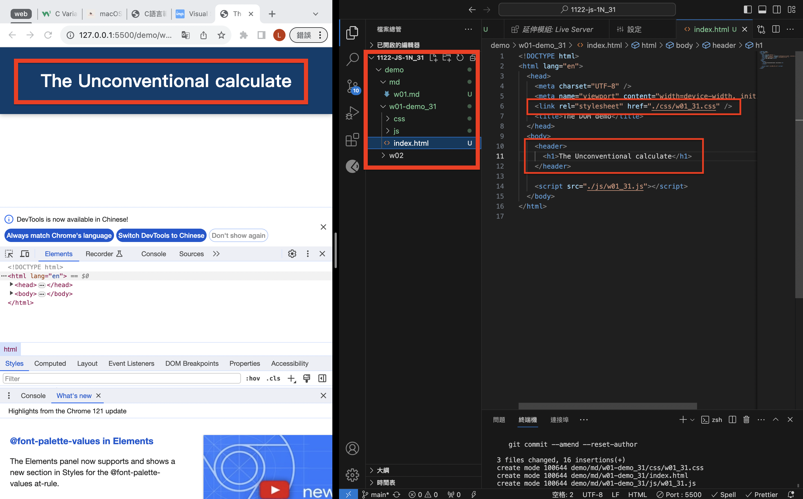
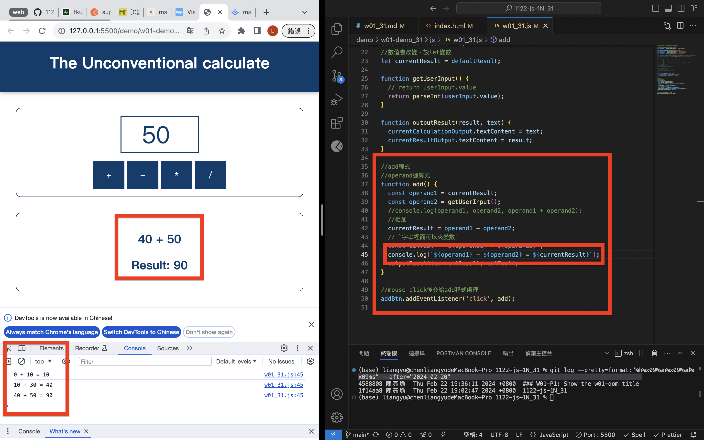
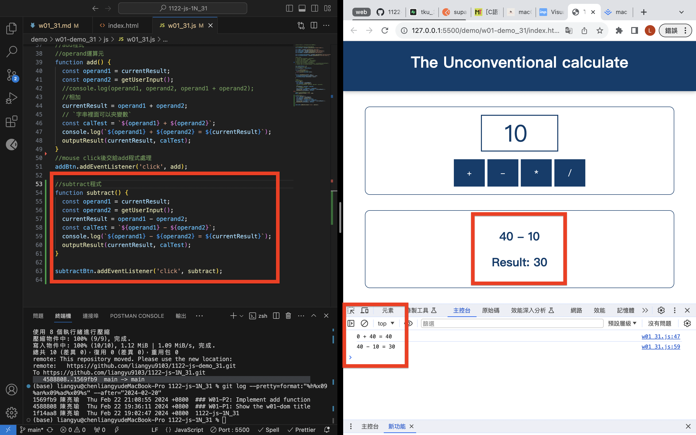

[Github](https://github.com/liangyu9103/1122-js-demo_31.git)

### W01-P1: Show the w01-dom title



```
4588808 陳亮瑜  Thu Feb 22 19:36:11 2024 +0800  ### W01-P1: Show the w01-dom title
```

### W01-P2: Implement add function



```
1569fb9 陳亮瑜  Thu Feb 22 21:08:55 2024 +0800  ### W01-P2: Implement add function
```

### W01-P3: Implement subtract function



### W01-P4:

### W01-Log:

```
git log --pretty=format:"%h%x09%an%x09%ad%x09%s" --after="2024-02-20"

```
