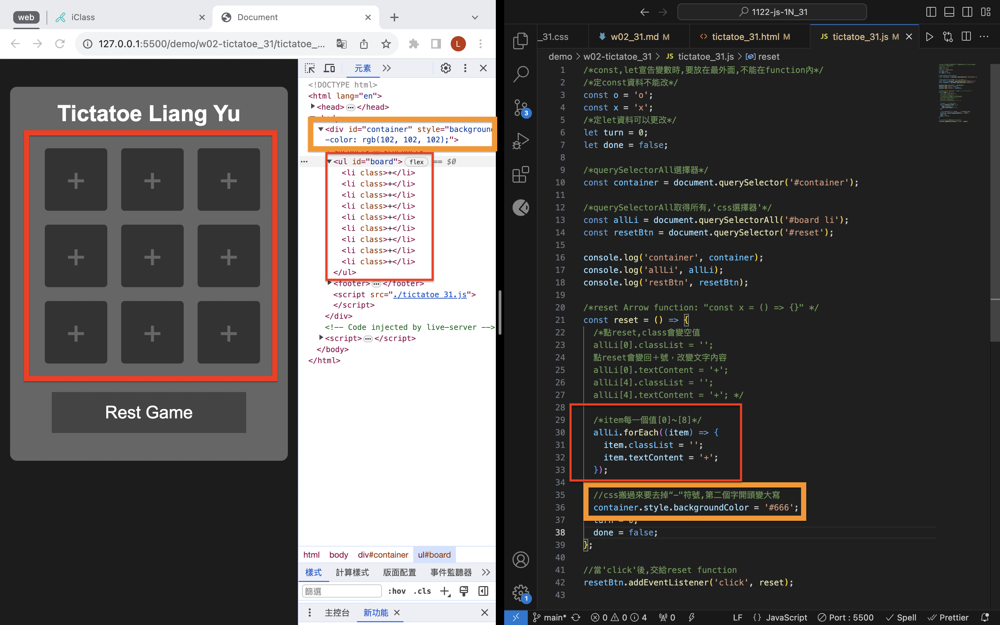

[Github](https://github.com/liangyu9103/1122-js-demo_31.git)

### W02-P1: Show Tictactoe css


```
4d4c174 ³¯«G·ì  Thu Feb 29 19:02:34 2024 +0800  ### W02-P1: Show Tictactoe css
```

### W02-P2: implement reset button



```

```

### W02-Log:

```
git log --pretty=format:"%h%x09%an%x09%ad%x09%s" --after="2024-02-27"

```
