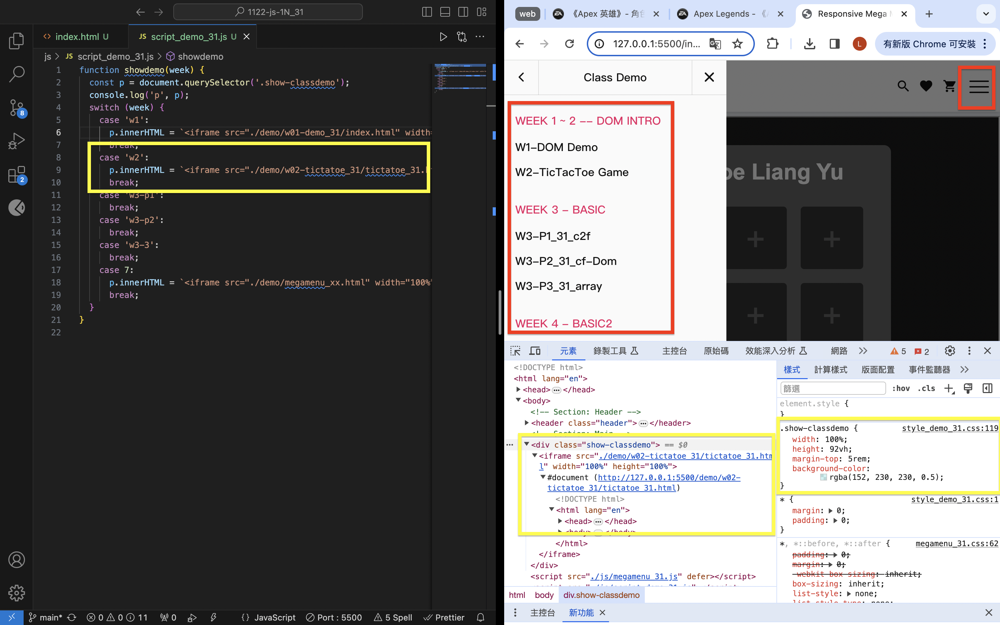

[Github](https://github.com/liangyu9103/1122-js-demo_31.git)

### W05-P1: Use megamenu to show class demo w1~W4 locally



```
8207be2 陳亮瑜  Thu Mar 21 19:02:54 2024 +0800  ### W05-P1: Use megamenu to show class demo w1~W4 locally
```

### W05-P2: Show W05-P1 in Vercel, add github and globe icons for Github and Vercel


```
88c8ecf 陳亮瑜  Thu Mar 21 19:37:08 2024 +0800  ### W05-P2: Show W05-P1 in Vercel, add github and globe icons for Github and Vercel
```

### W05-P3: Display Menu Items from menu json array on both local and Vercel

#### > local


#### > Vercel


```

```

### W05-Log:

```
git log --pretty=format:"%h%x09%an%x09%ad%x09%s" --after="2024-03-19"
```
