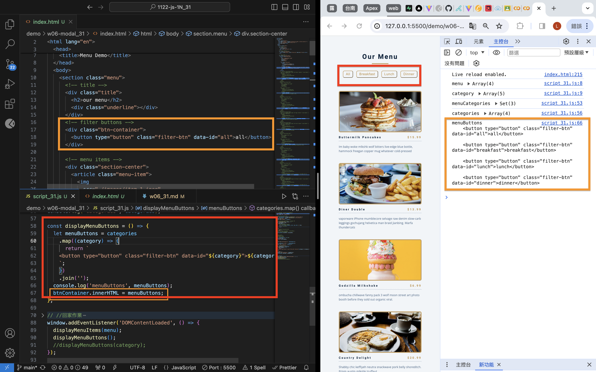
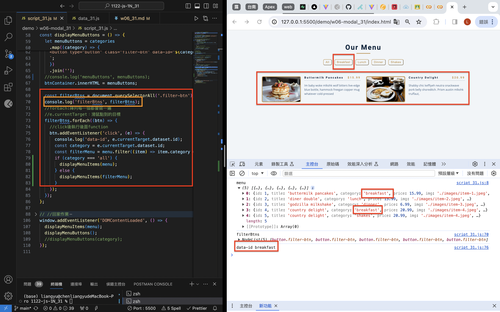
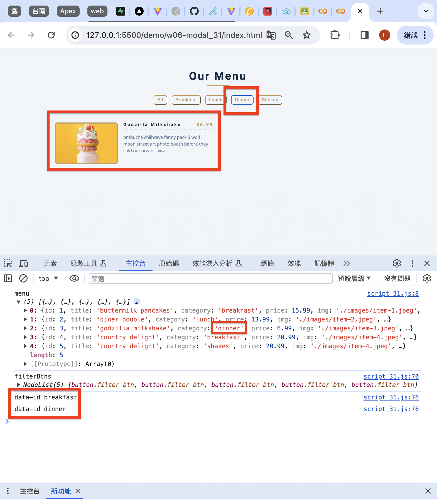
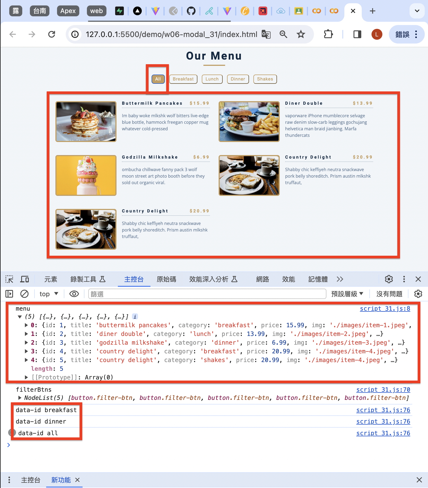

[Github](https://github.com/liangyu9103/1122-js-demo_31.git)
[Vercal](https://vercel.com/liangyu9103s-projects/1122-js-demo-31)

### W06-P1: Create categories dynamically from data_xx.js


```
f3df110 陳亮瑜  Thu Mar 28 19:52:51 2024 +0800  ### W06-P1: Create categories dynamically from data_xx.js
```

### W06-P2: Display Menu buttons from categories array



```
f59787f 陳亮瑜  Thu Mar 28 20:36:59 2024 +0800  ### W06-P2: Display Menu buttons from categories array
```

### W06-P3: implement filter buttons

#### => choose breakfast



#### => choose dinner



#### => choose all



### W06-Log:

```
git log --pretty=format:"%h%x09%an%x09%ad%x09%s" --after="2024-03-25"
```
