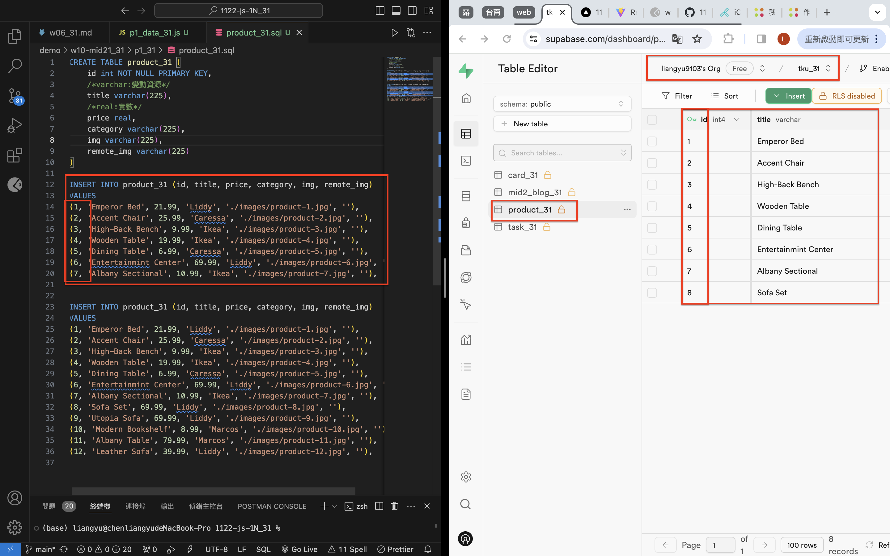
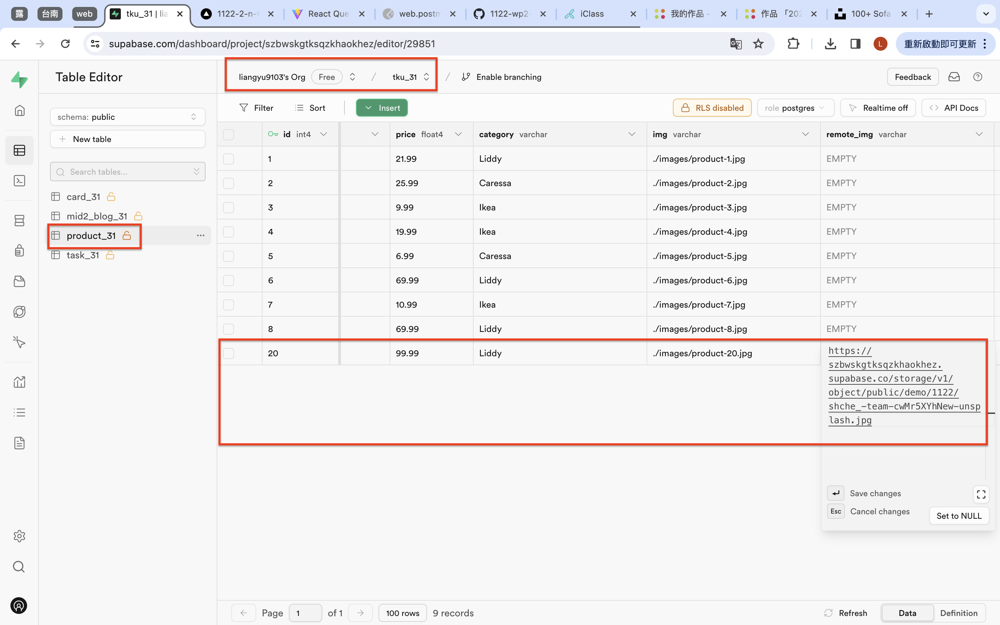
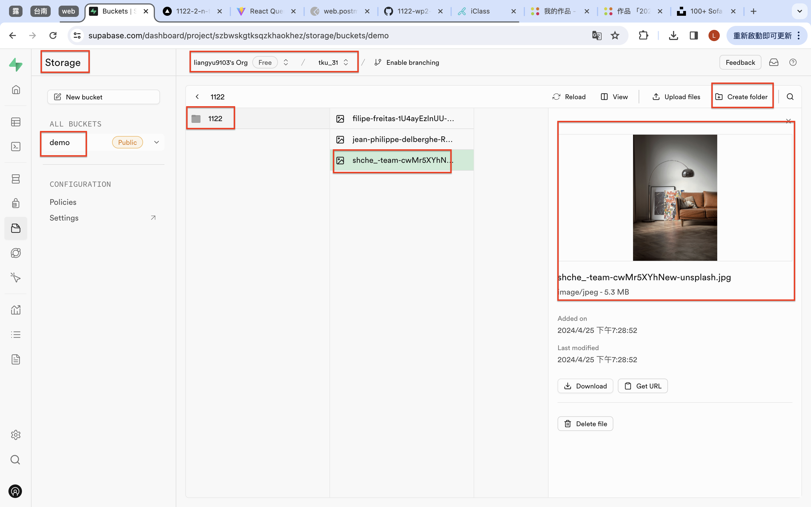

[Github](https://github.com/liangyu9103/1122-js-demo_31.git)
[Vercal](https://vercel.com/liangyu9103s-projects/1122-js-demo-31)

### W10-P1: In Supabase, create product_xx table with 8 product data



```
0fb3c45 liangyu9103     Thu Apr 25 19:17:44 2024 +0800  ### W10-P1: In Supabase, create product_xx table with 8 product data
```

### W10-P2: Get a photo from unsplash, and put it into storage in Supabase




```

```

```
git log --pretty=format:"%h%x09%an%x09%ad%x09%s" --after="2024-04-24"
```
