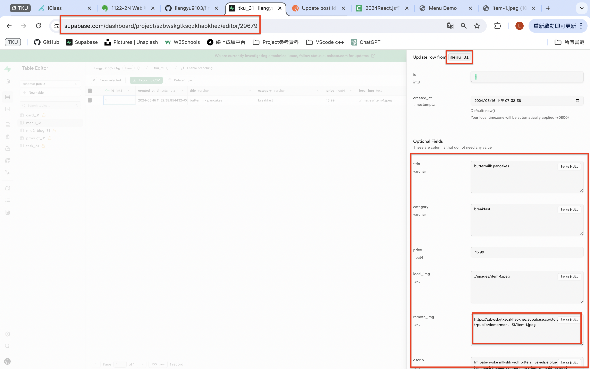
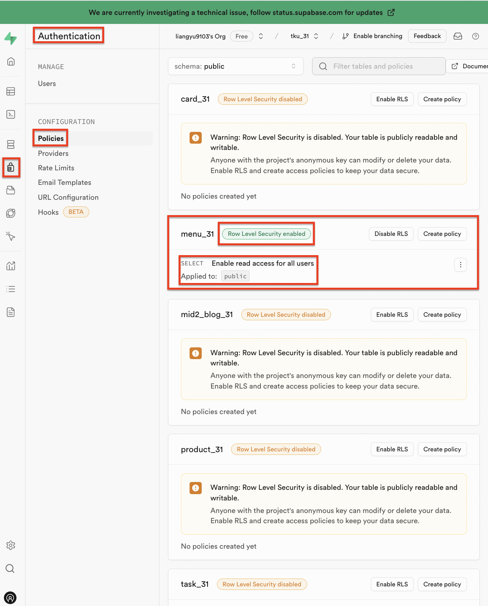
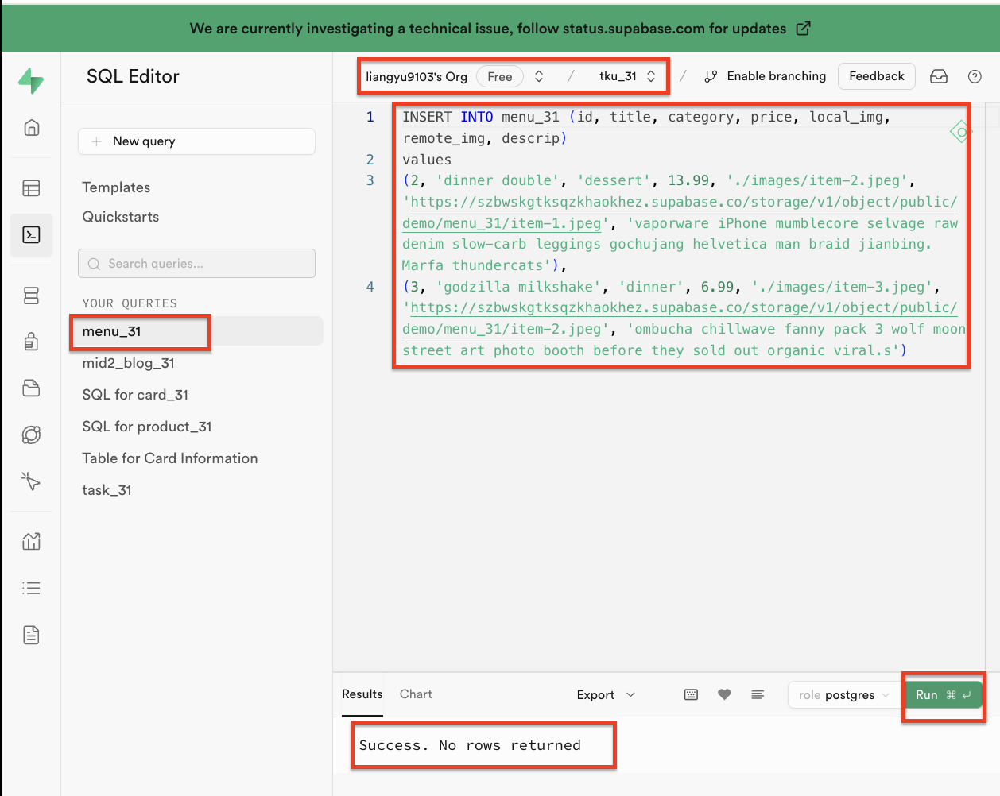
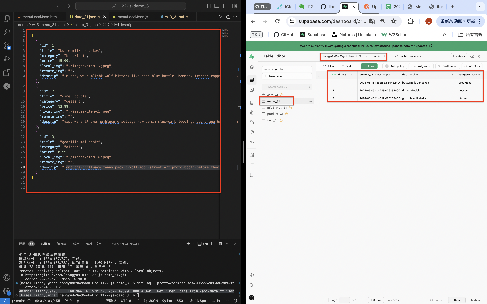

[Github](https://github.com/liangyu9103/1122-js-demo_31.git)
[Vercal](https://vercel.com/liangyu9103s-projects/1122-js-demo-31)

### W13-P1: Get 3 menu data from /api/data_xx.json


```
40a0b73 liangyu9103     Thu May 16 19:05:23 2024 +0800  ### W13-P1: Get 3 menu data from /api/data_xx.json
```

### W13-P2: Create 3 menu data from Supabase

#### => create menu_xx table, and add 1 menu data



#### => add RLS read policy for public access



#### => add two more menu data from SQL command



#### => show 3 menu data from menu_xx table



### W13 all code

```
git log --pretty=format:"%h%x09%an%x09%ad%x09%s" --after="2024-05-15"
```
