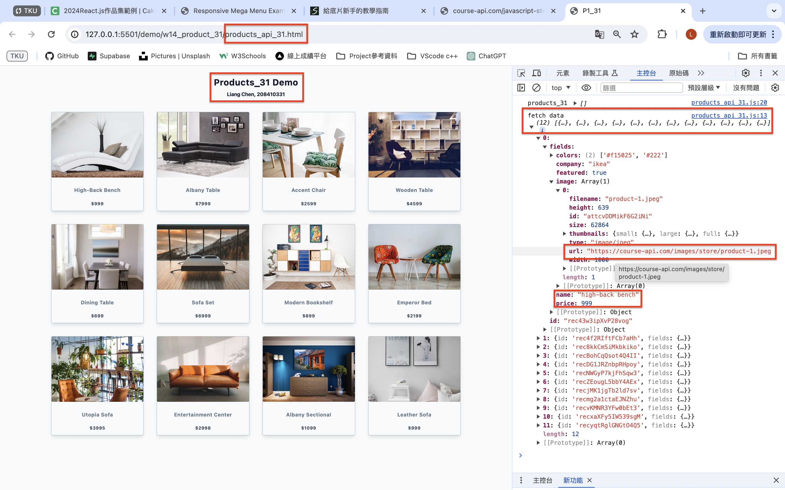
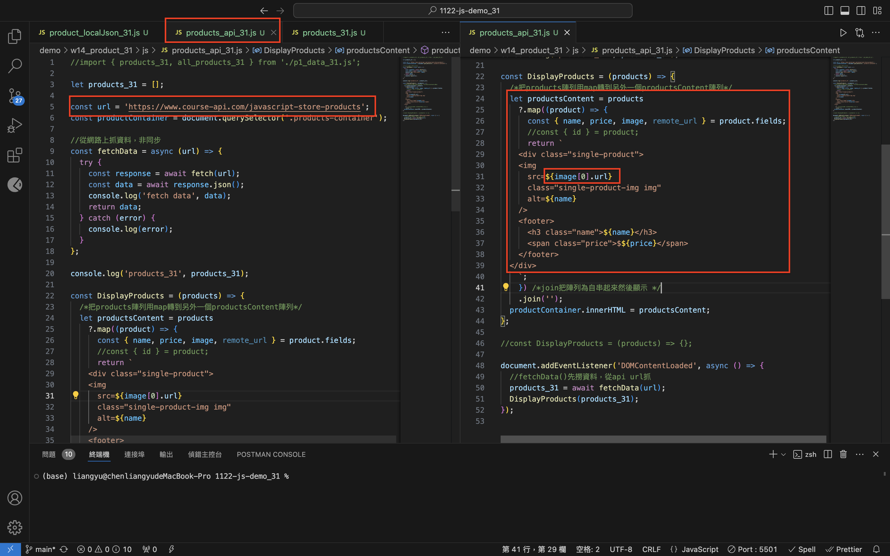
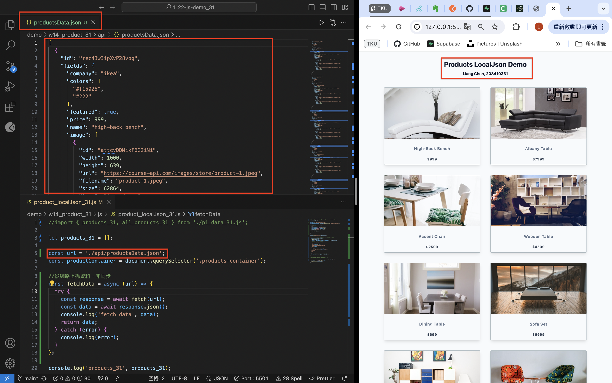
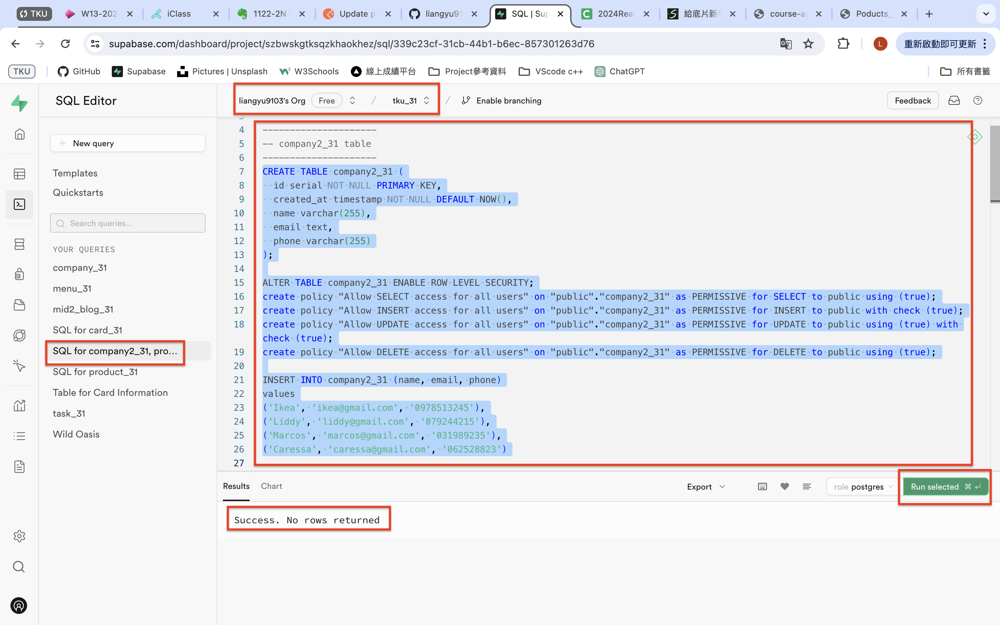
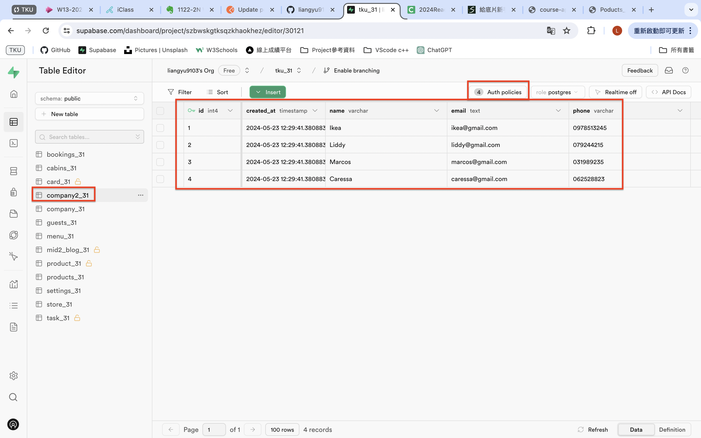
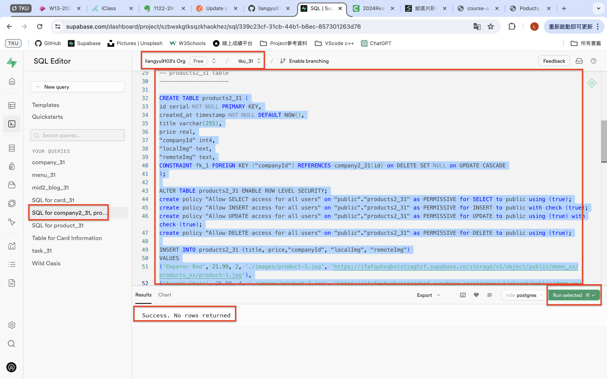
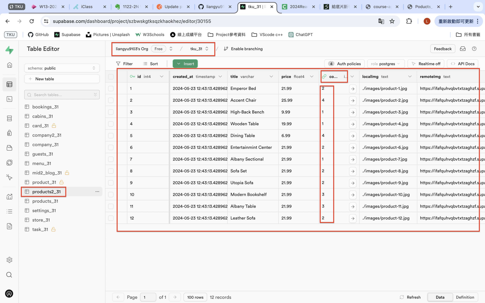

[Github](https://github.com/liangyu9103/1122-js-demo_31.git)
[Vercal](https://vercel.com/liangyu9103s-projects/1122-js-demo-31)

### W14-P1: Do products_api_xx.js to get data from an api url





```
e018002 liangyu9103     Thu May 23 19:25:22 2024 +0800  ### W14-P1: Do products_api_xx.js to get data from an api url
```

### W14-P2: Do products_localJson_xx.js to get local json data (/api/productsData.json)



```
8ae90dd liangyu9103     Thu May 23 19:46:41 2024 +0800  ### W14-P2: Do products_localJson_xx.js to get local json data (/api/productsData.json)
```

### W14-P3: Use SQL to create schemas and data for company_xx and products_xx

#### => company_xx schema and data





#### => products_xx schema and data





### W14 all code

```
git log --pretty=format:"%h%x09%an%x09%ad%x09%s" --after="2024-05-22"


```
