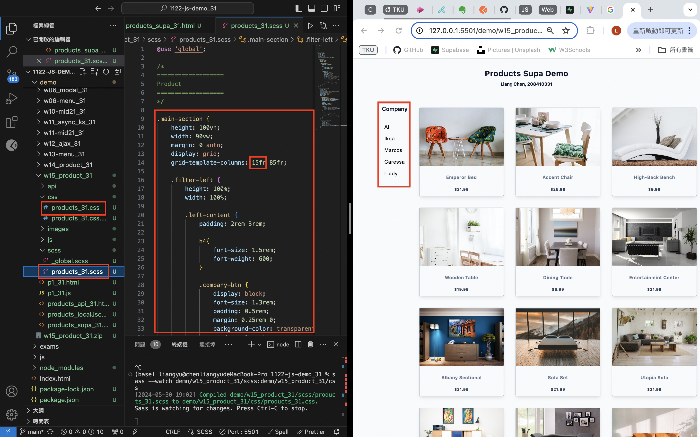
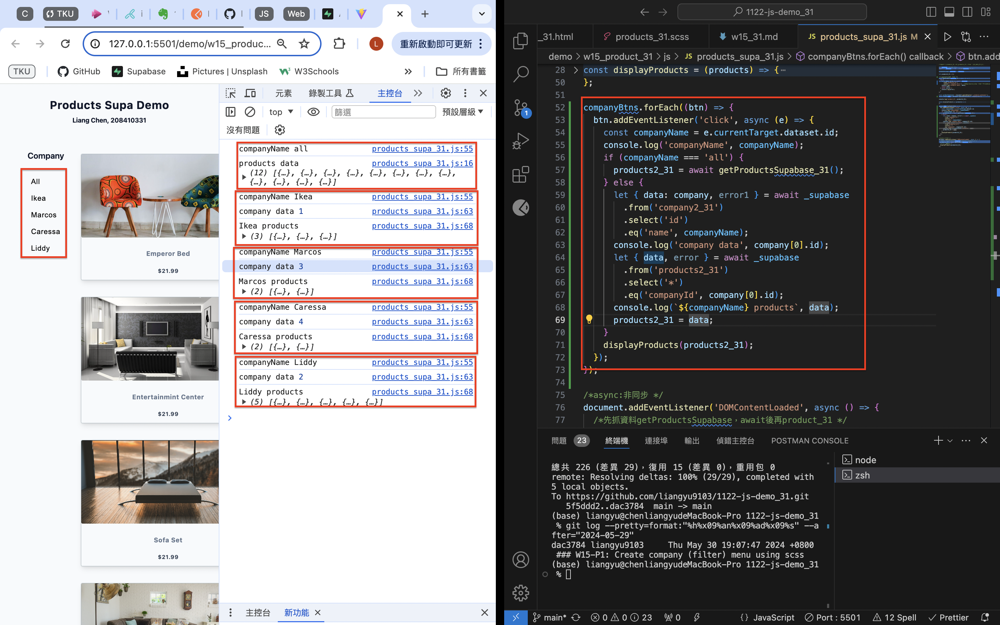
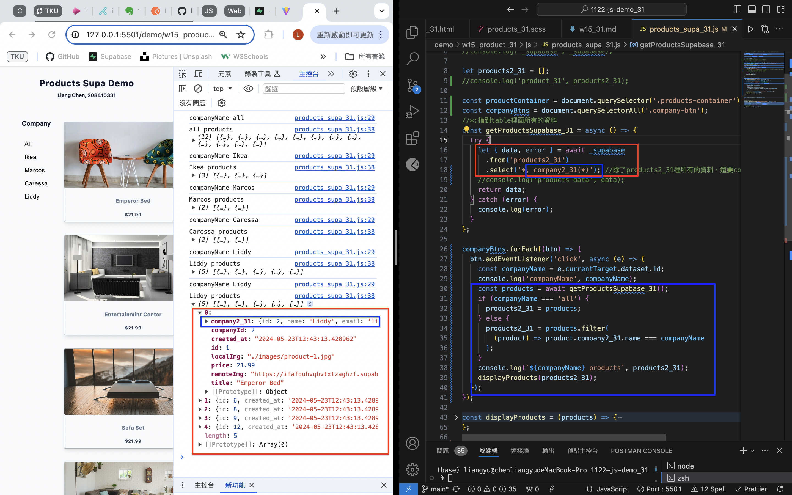
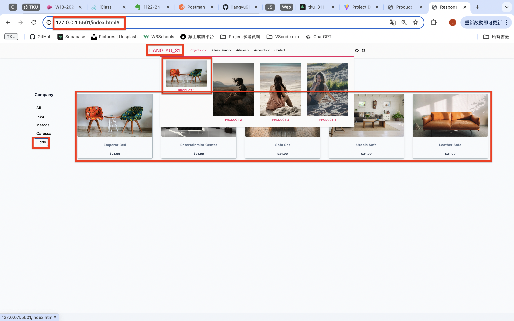
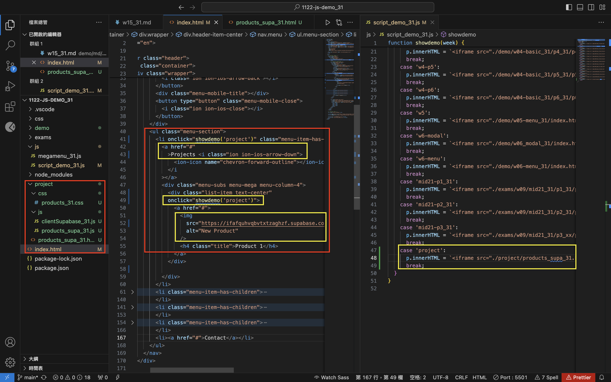
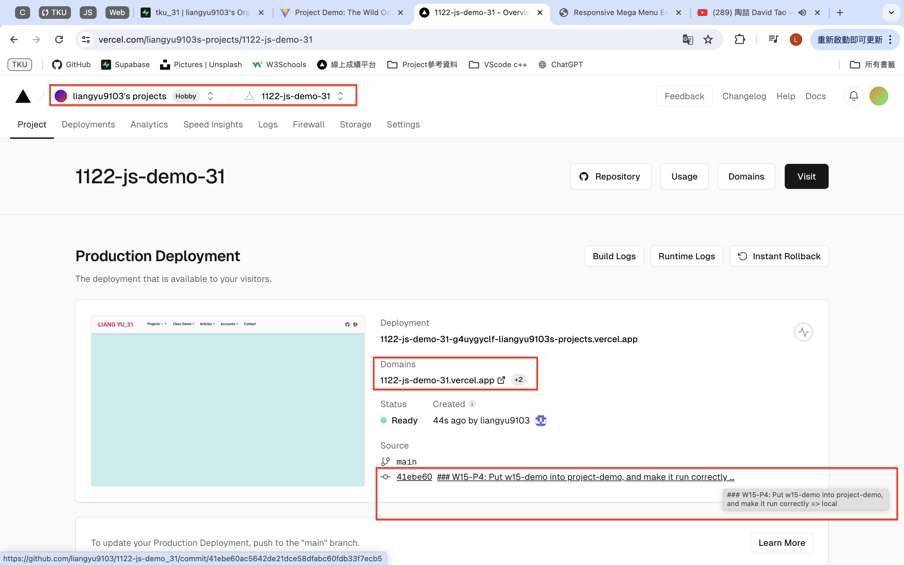
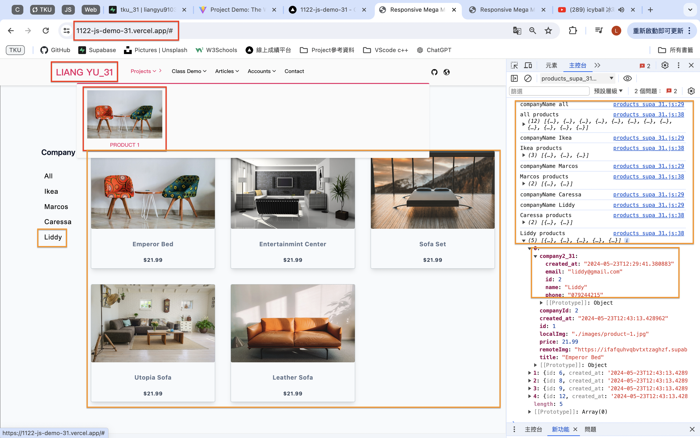

[Github](https://github.com/liangyu9103/1122-js-demo_31.git)
[Vercal](https://vercel.com/liangyu9103s-projects/1122-js-demo-31)

### W15-P1: Create company (filter) menu using scss



### W15-P2: Implement company filter functions, test for each company



### W15-P3: Implement company filter functions, test for each company using direct filtering of the products containing company data



### W15-P4: Put w15-demo into project-demo, and make it run correctly

#### => local





#### => Vercel





### W15 all code

```
git log --pretty=format:"%h%x09%an%x09%ad%x09%s" --after="2024-05-29"


```
